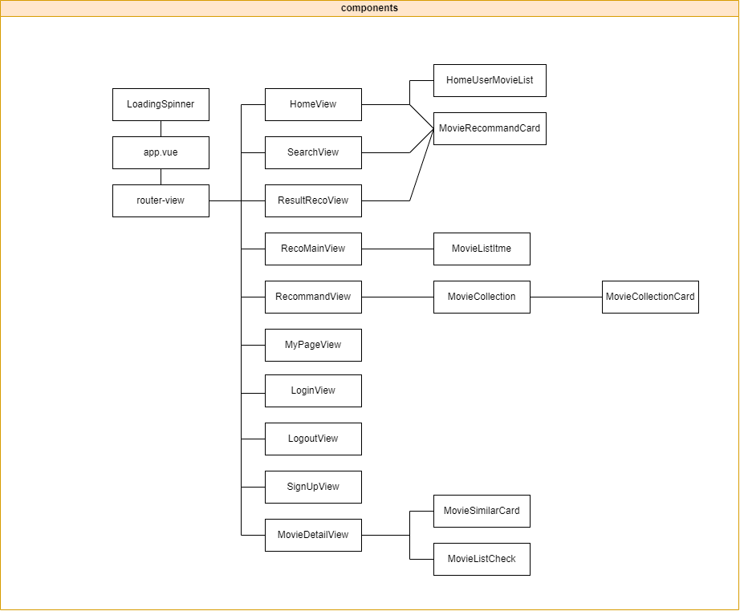

# Final_Project 🎞

영화 정보를 제공 및 추천 프로젝트 입니다.

영화의 정보를 제공하는 SSAFY 1학기의 마지막 프로젝트 입니다. 영화에 코멘트 작성 기능과 자신만의 영화리스트 만들기가 가능한 커뮤니티 기능이 포함됬습니다.

SSAFY에서 처음으로 진행하는 협업 프로젝트 이므로 먼저 기본적으로 구현해야하는 부분을 구현하고 꾸미는 것에 치중하기로 하였습니다. 기본적인 기능을 구현하면서 의논 하였던 것은 UI/UX의 부분의 의논이 많았습니다. 웹페이지를 제작하며 사용자에게 어떤 경험을 주고 그 경험을 주기 위해 UI와 back-server에서는 어떤 DB를 보내주어야하는 가를 제일 많이 의논하고 여러 아이디어가 나오고 구현하고 싶은 기능들이 많이 나왔기에 정리해가며 프로젝트를 시작하였습니다.

구현하고 싶은 것이 많이 나왔지만 프로젝트 제출 날짜가 정해져 있으므로 유튜브의 재생목록 시스템에 영감을 받아 사용자가 찜목록을 생성하고 각 목록에 여러 영화를 저장할수 있는 기능을 구현하기로 하였습니다. 사용자가 사용에 익숙한 시스템을 너어 좀더 편한 영화목록 생성을 통해 사용자에게 좋은 경험을 시켜주는 것을 목표로 하였습니다.

## 팀원 ⌨

###### 팀장: 용승민

###### 팀원: 김예은

## 프로젝트 진행 과정⚙

- 메인 페이지와 DB🧨

  - 프로젝트를 성공적으로 시작하기위해서 만들어야 했던 두가지라고 생각합니다. 먼저 메인페이지의 구성을 생각하고 이에 따라 DB를 tmdb에서 받아와 50개의 작은 DB를 구성하여 메인 페이지로 보내 보았습니다.
  - DB를 구성하면서 어떤 정보를 가져와야되는지 정하지 않고 간단하게 가져온 문제가 있었습니다 이후 상세페이지 구성을 위한 페이지 작성을 시작하였을 때 DB에 원하는 정보가 없었습니다.
- 상세 페이지와 DB작성📃

  - 상세 페이지 구성시 필요한 정보들과 추가적으로 원하는 정보들을 DB에 저장할 필요를 느끼게 되었습니다.
  - 원하는 정보를 위해 backend에 필요한 모델을 작성해 주었습니다.
    
  - 필요한 DB를 구성하기위해 Python으로 여러 request를 보내주었습니다.
    [&#39;DB를 작성하기위한 python file&#39;](https://lab.ssafy.com/yongsm295/final-pjt/-/blob/main/final-pjt-back/request.py)
  - 9966개의 영화 DB를 구현하였습니다.

##### 필수요소! 추천알고리즘! 🛠

이번 프로젝트에서는 추천알고리즘이 필수로 구현되어야 했습니다. 많은 아이디어가 나왔고 알고리즘을 통해 추천기능을 구현해보기 위해 최근접 이웃 기반 필터링 기능을 구현해보기로 하였습니다.

- 최근접 이웃 기반 필터링 : 사용자-아이템 행렬에서 사용자가 아직 평가하지 않은 아이템을 예측하는 것이 목표

이때 아이템으로 영화 장르를 선택했습니다. 장르를 통해 다른 영화를 추천해주었습니다.

- 추천페이지에서 영화를 골라 보내준다.
- 받은 영화제목의 index를 뽑아낸다.
- 코사인 유사도 중 영화 제목 인덱스에 해당하는 값에서 추천영화를 뽑아낸다.
  - 행렬 분해를 기반하여 사용한다. 이 방법은 python pandas의 pivot table로 지원해준다.
- 이 때 여러 영화가 들어오면 각각 뽑아낸다.
- 뽑아낸 영화중 중복이 있다면 중복을 우선으로 정렬하고 rating을 적용한 추천점수 기반으로 정렬한다.
- 정렬된영화중 5개를 추천해준다.

```python
def find_movie():
    pd.set_option('display.max_rows', 10000) # 행설정
    pd.set_option('display.max_columns', 10000) # 열 설정
    pd.set_option('display.width', 10000) # 출력 창 넓이 설정

    data = pd.read_csv('movieitem.csv', encoding='UTF-8') # 영화정보가 담긴 csv파일
    data = data[["title", "release_date", "popularity","vote_count","vote_average","genres","actor","director","id"]]
    m = data["vote_count"].quantile(0.9) 

'''
투표수가 많을수록 사람들이 많이 보고 평가한 영화 이런 영화중 많은 투표로 인해 
투표 점수가 낮을 수 있다 이러한 불공정을 처리하기 위해 가중치를 두었다.
이때 이 가중치 처리 식 가중 평점(WR) = (v ÷ (v+m)) × R + (m ÷ (v+m)) × C 여기에서:

R = 영화의 평균(평균) = (등급)
v = 영화에 대한 투표 수 = (votes)
m = 상위에 포함되기 위해 필요한 최소 투표 수
C = 전체 보고서의 평균 투표
출처 : https://www.quora.com/How-does-IMDbs-rating-system-work
'''

    # data = data.loc[data["vote_count"] >= m]
    C = data['vote_average'].mean()

    def weighted_rating(x,m=m,C=C):
        v=x["vote_count"]
        R=x['vote_average']
        return (v/(v+m)*R)+(m/(m+v)*C)


    data['recommed_count']=data.apply(weighted_rating,axis=1) #list와 dict형태로 만들고
    data['genres'] = data['genres'].apply(literal_eval)
    data['genres']=data['genres'].apply(lambda x : [d['name'] for d in x]).apply(lambda x: " ".join(x))
	# list 형태에서 string형태로 만들었다.

    data.to_csv('data2.csv')
    count_vector = CountVectorizer(ngram_range=(1,3))
    c_vector = count_vector.fit_transform(data['genres'])
      #코사인 유사도를 구한 벡터를 미리 저장
    sparse.save_npz("yourmatrix.npz", c_vector)
```

위에 구한 코사인 유사도를 저장시킨 파일을 불러 영화를 추천해주었습니다.
[&#39;영화 추천 알고리즘 파일&#39;](https://lab.ssafy.com/yongsm295/final-pjt/-/blob/main/final-pjt-back/movies/recommande_movie.py)

## DB완성! 프론트구현 📢

- 필요한 DB가 무었인지 알게되어 DB작성이 끝난후 본격적으로 frontend 작성을 시작하였습니다.
  
- 완성되면 사진넣을 곳

## 후기

##### 용승민

SSAFY공부를 시작하고 처음으로 구현해보는 협업 프로젝트였습니다. SSAFY에서 배운 모든것을 사용해보려 노력하였고 지금까지 해주셧던 수업에 지나가던 말들이 중요한순간에 필요하였습니다. 이 때 비로소 필요한 것을 느끼게 되었고 더 많이 공부할걸 이라는 아쉬움이 남고 제가 더 공부해야할 부분에대해 느끼게 해주는 좋은 기회 였습니다. 힘든 과정이였지만 좋은 팀원과 함께하여 즐거웠습니다. 부족함을 느낀만큼 다음 프로젝트전까지 많은 준비를 해야겠습니다.

##### 김예은
